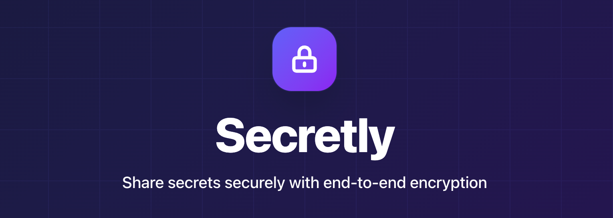

# Secretly

**Secretly** is a modern, secure secret sharing service that uses client-side encryption to ensure your sensitive information remains private. Secrets are encrypted in your browser before being sent to our servers, and can only be decrypted with a key embedded in the shareable URL.

## Features

- **End-to-End Encryption**: All encryption happens client-side using AES-GCM 256-bit
- **Zero-Knowledge Architecture**: Our servers never see your plaintext secrets
- **One-Time View**: Secrets self-destruct after being viewed once

## Process Overview

```
┌─────────┐                      ┌──────────┐
│ Browser │                      │ Secretly │
└────┬────┘                      └─────┬────┘
     │                                 │
     │  1. Generate encryption key     │
     │  2. Encrypt secret locally      │
     │                                 │
     │─ 3. POST /secrets ─────────────>│
     │     {ciphertext, iv}            │
     │                                 │
     │<─── {id} ───────────────────────│
     │                                 │
     │  4. Share: /secret/{id}#{key}   │
     │                                 │
     │─ 5. GET /secrets/{id} ─────────>│
     │                                 │
     │<─── {ciphertext, iv} ───────────│
     │                                 │
     │  6. Decrypt secret using key    │
     │     from URL fragment           │
     │                                 │
```

## Tech Stack

- **Frontend**: TypeScript/React/Vite
- **Backend**: Python/FastAPI/PostgreSQL

## Development

**Frontend:**
```bash
cd frontend
cp .env.example .env
nvm use
npm install
npm run dev # http://localhost:5173
```

**Backend:**
```bash
cd backend
make start # http://localhost:8000
```

## Testing

Run all the same checks as CI with `npm run can-release` (frontend) and `make can-release` (backend).

Additionally, end-to-end tests can be found in [./e2e](./e2e).
Run them with `make run-e2e`.
This assumes [k6](https://k6.io) is installed on your machine.
Alternatively, run in Docker the way CI does with `CI=1 make run-e2e`.
You can also run them in non-headless mode with `HEADLESS=0 make run-e2e` (requires a Chromium-based browser).

## API Documentation

Once the backend is running, interactive API documentation is available at:
- **Swagger UI**: http://localhost:8000/docs
- **ReDoc**: http://localhost:8000/redoc

### Endpoints

- `POST /secrets` - Create a new secret
- `GET /secrets/{id}` - Retrieve a secret (one-time access)
